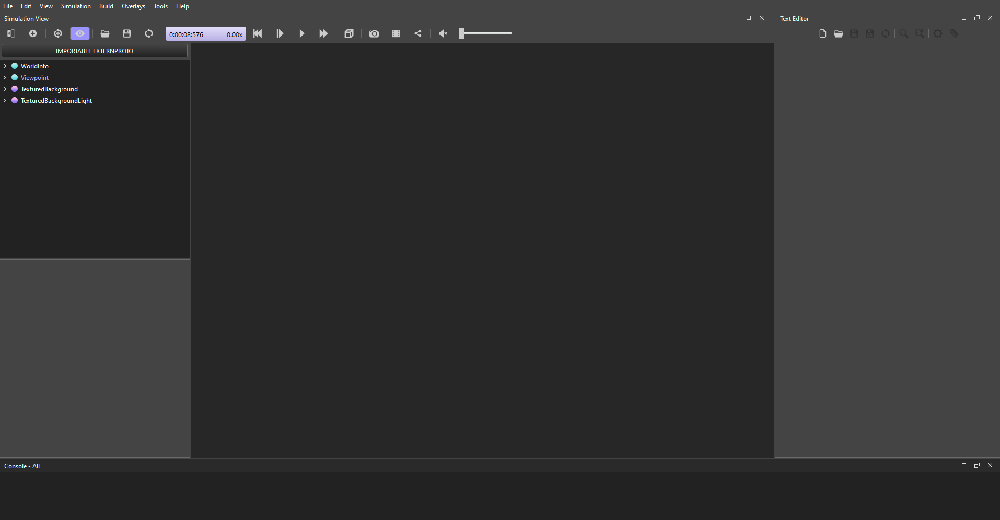

# This is for publication of Swarm-RAL
to test and chekcing the timings of each state machine and record them 

# Running Python?
We use UV package manager. Install `pipx install uv` pipx so it's isolated.
1. run `uv sync` this create an venv and install all of the packages required
all dependancies are in the pyproject.toml
2. add the path to the interpreter i.e. `.../swarm-final-project-ise/simulation-probing/.venv/bin/python`
# Using Webots
## Installing Webots

You can install Webots from the [Cyberbotics](https://cyberbotics.com) website

### Installing with Windows

You can download the executable and follow the setup procedures. After creating a new project, you will see this screen.

Then, you can start simulating!

# About on-going development 
other core developement will be located in simulation/poc

# About main 
For the main sim file, the flow will be based on the final proposal file located [/reports/project_proposal/Final_Project_Proposal.pdf](../reports/project_proposal/Final_Project_Proposal.pdf)

## how webots works 
each the "TurtleBot3Burger_X" are using the [swarmfile](simulation/main/controllers/swarm/swarm.py) for the running the logic for each robot 

if not sure about how to use webot package "controller" [read here](https://cyberbotics.com/doc/reference/robot)

## Steps of the ideal simulation for MVP 1
Given: Known environment/map & perfect odometry
1. **START SIMULATION**
1. 3 robots 'searching' for a *cylinder* object [CV]
1. object is found, the robot which found is master and the coordinate to the rest 
    - **Edge-case**: 2+ found same-time -> ranked order by the id of robots
1. each robot surrounding the object 120° equal distant x from center of *cylinder*. 
1. each robot move into the center untill conlision
1. move 50cm to any direction using 1 robot(due to the diff drive of the turtlebot)
2. **STOP SIMULATION**