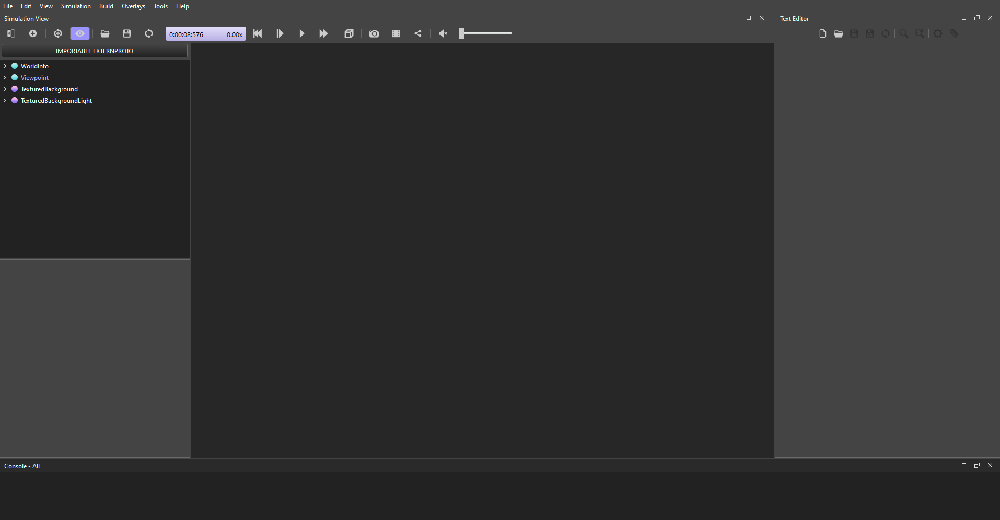

# Using Webots

## Installing Webots

You can install Webots from the [Cyberbotics](https://cyberbotics.com) website

### Installing with Windows

You can download the executable and follow the setup procedures. After creating a new project, you will see this screen.

Then, you can start simulating!
